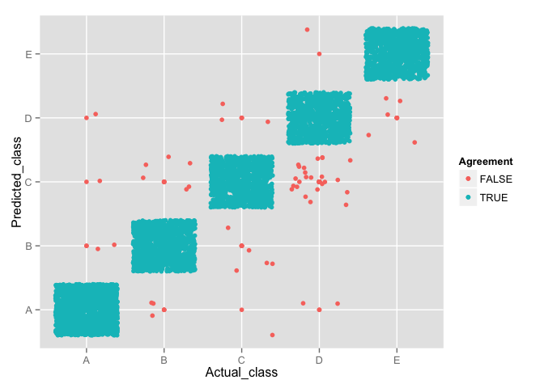

# Random forests and barbells: Tree-based prediction of exercise quality
Jake W. Knigge  
November 21, 2015  

# Overview and background

The era is the computable-self (or "quantified self") has taken hold in a number of communities, some "techie" and others mainstream.  Indeed, Stephen Wolfram (of *Mathematica* and *Wolfram Alpha* fame) has a blog post on "The Personal Analytics of My Life" where he steps through his email, keystroke, event, phone-call, and step (i.e., pedometer) data.  His post can be found here: [blog.stephenwolfram.com](http://blog.stephenwolfram.com/2012/03/the-personal-analytics-of-my-life/).

The fitness community has embraced the notion of the computable-self "using devices such as *Jawbone Up*, *Nike FuelBand*, *Fitbit*," and the *Apple Watch*, which are minimally intrusive to the wearer and provide low-cost data.  For example, *Fitbit* provides its wearers with pedometer, steps-climbed, and heart-rate data.  Thus far, it appears that the fitness community has focused on quantity rather than quality.

In this analysis, we use data from multiple accelerometers (located on the belt, forearm, arm, and dumbbell) from six participants to predict the quality (i.e., correctness) of the exercise performed.  The participants performed barbell lifts in 5 different ways, some correctly and some incorrectly.

The data were obtained from Ugulino et. al. at: [groupware.les.inf.puc-rio.br/har](http://groupware.les.inf.puc-rio.br/har).

# The data analytic process

In this section, we provide the details and supporting code used to develop an "exercise quality"" prediction model.  The first chunk of code loads the necessary packages for producing the analysis.


```r
require(ggplot2)
require(dplyr)
require(caret)
require(randomForest)
```

## Reading and loading data

Note, we assume that the data files are located within R's working directory.  The data are read in from the csv file and then converted to numeric data types (where appropriate).


```r
# Read in human activity recognition data
pml_df <- read.csv("pml-training.csv", stringsAsFactors = FALSE)

# Convert mis-structured variables to numeric data type
pml_df[, 8:159] <- sapply(pml_df[, 8:159], as.numeric)
```

## Variable elimination and selection

We first identify variables with high "NA" counts to reduce the number of covariates.  This process eliminates a number of "summary" variables (e.g., maximums, minimums, averages, standard deviations, etc.), which should be captured in the underlying "raw data".  After pruning the large number of "NA" variables, we further eliminate the remaining summary variables and select raw variables as indicated by the `gyros`, `accel`, `pitch`, `yaw`, and`roll` prefix.  Thirty-two covariates remain after pruning the initial data set; the remaining covariates were combined with the response variable to create a data frame to train the model.


```r
# Determine where the NAs "live"
zero_vars <- colSums(is.na(pml_df[,8:159]))
quant_var_names <- names(pml_df[,8:159])

# Exclude variables with many NAs
exclude_var <- which(zero_vars > 0)
# Output the first round of selected variables
quant_var_names[-exclude_var]
```

```
##  [1] "roll_belt"            "pitch_belt"           "yaw_belt"            
##  [4] "total_accel_belt"     "gyros_belt_x"         "gyros_belt_y"        
##  [7] "gyros_belt_z"         "accel_belt_x"         "accel_belt_y"        
## [10] "accel_belt_z"         "magnet_belt_x"        "magnet_belt_y"       
## [13] "magnet_belt_z"        "roll_arm"             "pitch_arm"           
## [16] "yaw_arm"              "total_accel_arm"      "gyros_arm_x"         
## [19] "gyros_arm_y"          "gyros_arm_z"          "accel_arm_x"         
## [22] "accel_arm_y"          "accel_arm_z"          "magnet_arm_x"        
## [25] "magnet_arm_y"         "magnet_arm_z"         "roll_dumbbell"       
## [28] "pitch_dumbbell"       "yaw_dumbbell"         "total_accel_dumbbell"
## [31] "gyros_dumbbell_x"     "gyros_dumbbell_y"     "gyros_dumbbell_z"    
## [34] "accel_dumbbell_x"     "accel_dumbbell_y"     "accel_dumbbell_z"    
## [37] "magnet_dumbbell_x"    "magnet_dumbbell_y"    "magnet_dumbbell_z"   
## [40] "roll_forearm"         "pitch_forearm"        "yaw_forearm"         
## [43] "total_accel_forearm"  "gyros_forearm_x"      "gyros_forearm_y"     
## [46] "gyros_forearm_z"      "accel_forearm_x"      "accel_forearm_y"     
## [49] "accel_forearm_z"      "magnet_forearm_x"     "magnet_forearm_y"    
## [52] "magnet_forearm_z"
```

```r
# Based on the variables output above, further eliminate
#     variables that appear to be summaries of other
#     variables 

# Select non-summary variables (i.e., raw variables)
gyro_ind <- grep("^gyros_", names(pml_df))
accel_ind <- grep("^accel_", names(pml_df))
pitch_ind <- grep("^pitch_", names(pml_df))
yaw_ind <- grep("^yaw_", names(pml_df))
roll_ind <- grep("^roll_", names(pml_df))
keepers <- c(gyro_ind, accel_ind, pitch_ind, roll_ind)

# Reduce size of data frame to include selected variables and response variable
training <- pml_df[, c(keepers, 160)]
```

## Model fitting: growing forests

We use random forests to classify the exercise class.  Random forest have the interpretability and low-bias properties of tree-based methods, but reduce the variance of typical tree-based methods (including bagged trees) by growing (i.e., fitting) a large number of independent trees.  Independent trees are averaged to produce a low-bias, low-variance estimator.  Recall that the standard deviation of the mean (of i.i.d. variables) decreases at the rate of $\sqrt{n}$, where $n$ is the sample size.  Thus, the central limit theorem provides support the random forest variance-reduction appraoch.

To allow for reproducibility, we set the random number seed (using the `set.seed()` function) before splitting our data set into a training and cross validation and before fitting the random forest model.  We supply additional training control arguments before fitting the model to reduce the time to fit the model: e.g., number of trees, number of cross-validation folds, parallel processing, etc.


```r
# Set seed for reproducibility
set.seed(111)

training1_ind <- createDataPartition(training$classe, p = 0.7, list = FALSE)
training1 <- training[training1_ind, ]
cvSet <- training[-training1_ind, ]

# Set seed for reproducibility
set.seed(222)

# Fit random forest classification model
# Produce 250 trees to average across: ntree = 250
# Train using 5-fold cross-validation
# Allow parallel computation to improve fitting time
rfFit <- train(x = training1[, 1:32],
               y = training1$classe, 
               data = training1, 
               method = "rf",
               trControl = trainControl (method = "cv",
                                         number = 5),
               ntree = 250,
               prox = TRUE,
               allowParallel = TRUE)
rfFit$finalModel
```

```
## 
## Call:
##  randomForest(x = x, y = y, ntree = 250, mtry = param$mtry, proximity = TRUE,      data = ..1, allowParallel = TRUE) 
##                Type of random forest: classification
##                      Number of trees: 250
## No. of variables tried at each split: 2
## 
##         OOB estimate of  error rate: 0.87%
## Confusion matrix:
##      A    B    C    D    E class.error
## A 3898    2    4    2    0 0.002048131
## B   18 2631    8    0    1 0.010158014
## C    1   17 2368   10    0 0.011686144
## D    0    1   40 2211    0 0.018206039
## E    1    0    5   10 2509 0.006336634
```

### Random forest history and reference

Random forests popularity are primarily due to Leo Breiman (2001), who used the approach as an alternative to bagged trees in order to avoid increased variance due to correlated trees.  Refer to Chapter 15 of *ESL* for a detailed yet clear discussion on random forests.

## Model diagnostics

Per Hastie et. al. in *The Elements of Statistical Learning* (*ESL*), variable importance is an informative model diagnostic for random forests.  Variable importance measures "the improvement in the split-criterion" for each split in each classification tree (*ESL* p. 593).  In a Breiman-esque fashion, the improvements are aggregated across all trees in the forest for each variable.  Thus, a splitting variable that accumulates many split improvements will have a higher (relative) importance.  Note, the variable importance metrics shown below have been scaled so that the most important variable has an importance of 100.


```r
# Plot the top twenty "importance factors"
rfImp <- varImp(rfFit)
plot(rfImp, top = 20)
```

 

Consistent with the above information on variable importance, the below box plot shows that the `roll_belt` variable explains considerable variance in exercise `classe` variable.  The plot is colored according to the second-most important factor, which is the `pitch_forearm` variable.


```r
qplot(x = classe, y = roll_belt, data = pml_df,
      color = pitch_forearm, geom = c("boxplot", "jitter"),
      main = "Roll-belt measurements explain variance in exercises")
```

 

## Cross-validation predictions

We apply the model to the cross-validation set to gain a sense of the model's predictive power.  A confusion matrix shows the model's predictions versus the actual exercise classes.


```r
# Cross validation
cv_pred <- predict(rfFit, cvSet)

# Output confusion matrix to visualize prediction error
confusionMatrix(table(cv_pred, cvSet$classe))
```

```
## Confusion Matrix and Statistics
## 
##        
## cv_pred    A    B    C    D    E
##       A 1670    3    1    2    0
##       B    2 1130    5    0    0
##       C    1    6 1017   24    0
##       D    1    0    3  937    5
##       E    0    0    0    1 1077
## 
## Overall Statistics
##                                          
##                Accuracy : 0.9908         
##                  95% CI : (0.988, 0.9931)
##     No Information Rate : 0.2845         
##     P-Value [Acc > NIR] : < 2.2e-16      
##                                          
##                   Kappa : 0.9884         
##  Mcnemar's Test P-Value : NA             
## 
## Statistics by Class:
## 
##                      Class: A Class: B Class: C Class: D Class: E
## Sensitivity            0.9976   0.9921   0.9912   0.9720   0.9954
## Specificity            0.9986   0.9985   0.9936   0.9982   0.9998
## Pos Pred Value         0.9964   0.9938   0.9704   0.9905   0.9991
## Neg Pred Value         0.9990   0.9981   0.9981   0.9945   0.9990
## Prevalence             0.2845   0.1935   0.1743   0.1638   0.1839
## Detection Rate         0.2838   0.1920   0.1728   0.1592   0.1830
## Detection Prevalence   0.2848   0.1932   0.1781   0.1607   0.1832
## Balanced Accuracy      0.9981   0.9953   0.9924   0.9851   0.9976
```

The confusion matrix and related statistics demonstrate the predictive power of the random forest on an unseen data set.  As is typical, the accuracy, specificity, and sensitivity decreased relative to the training set; however, the metrics indicate that the model is robust with respect to new data.


```r
# Create comparison data frame
cv_comp <- data.frame(cvSet$classe, cv_pred, cvSet$classe == cv_pred)
names(cv_comp) <- c("Actual_class", "Predicted_class", "Agreement")
# Plot agreement matrix
qplot(x = Actual_class, y = Predicted_class, 
      data = cv_comp, geom = c("point", "jitter"), color = Agreement)
```

 

The above plot helps us visualize the confusion matrix and colors the misclassified exercises.  Note that the actual activity is on the x-axis and the predicted activity is on the y-axis.

# Error measures

This section describes various error measures and culminates with an estimate on the out-of-sample prediction error.

## Training set error
We fit the random forest model using 70% of the data measurements, leaving 30% for cross-validation.  The model had an accuracy of 100% with a 95% confidence from `(0.9997, 1)` on the training set.  The error was 0% on the training set.


```r
# Predict exercise class for training set
training_pred <- predict(rfFit, training1)

# Compare predictions to actuals and summarize in a confusion matrix
confusionMatrix(table(training_pred, training1$classe))
```

```
## Confusion Matrix and Statistics
## 
##              
## training_pred    A    B    C    D    E
##             A 3906    0    0    0    0
##             B    0 2658    0    0    0
##             C    0    0 2396    0    0
##             D    0    0    0 2252    0
##             E    0    0    0    0 2525
## 
## Overall Statistics
##                                      
##                Accuracy : 1          
##                  95% CI : (0.9997, 1)
##     No Information Rate : 0.2843     
##     P-Value [Acc > NIR] : < 2.2e-16  
##                                      
##                   Kappa : 1          
##  Mcnemar's Test P-Value : NA         
## 
## Statistics by Class:
## 
##                      Class: A Class: B Class: C Class: D Class: E
## Sensitivity            1.0000   1.0000   1.0000   1.0000   1.0000
## Specificity            1.0000   1.0000   1.0000   1.0000   1.0000
## Pos Pred Value         1.0000   1.0000   1.0000   1.0000   1.0000
## Neg Pred Value         1.0000   1.0000   1.0000   1.0000   1.0000
## Prevalence             0.2843   0.1935   0.1744   0.1639   0.1838
## Detection Rate         0.2843   0.1935   0.1744   0.1639   0.1838
## Detection Prevalence   0.2843   0.1935   0.1744   0.1639   0.1838
## Balanced Accuracy      1.0000   1.0000   1.0000   1.0000   1.0000
```

### Out-of-bag training set error

We note that the model had an *out-of-bag* (OOB) error of 0.87% on the training set---implying an OOB accuracy of 99.13%.  The OOB error provides a more conservative estimate on the training error because it leaves out certain samples when fitting trees.

Random forests use OOB samples as part of its fitting process.  OOB samples can be thought of as similar to *leave-one-out* cross validation samples.  Each training example is predicted by "averaging only those trees corresponding to bootstrap samples in which [the training example] did not appear" (*ESL*, page 593). See Chapter 15 in *ESL* (Hastie et. al.) for a more detailed discussion.

## Cross-validation error

As shown in the *Cross-validation predictions* section above, the model had an accuracy of 99.05% on the cross validation set with a 95% confidence interval of `(0.9877, 0.9928)`.  The error is approximately 0.95% on the cross-validation.  Note that the cross-validation prediction error is greater than the training set error (0%) and the OOB error (0.87%).

## Out-of-sample error estimates

Given that the training error (also referred to as the in-sample error) is typically an optimistic estimate of the out-of-sample error because the model is estimated using the training set; thus, the model may interpret *noise* as *signal* and capture that noise in the model's parameters (which adds variance to the model). 

Conservatively, we can lower-bound the error as the maximum of the training set error, OOB error, and cross-validation error: 0.95%.  In addition, we can add the expected optimism (as defined by Hastie et. al. in *ESL* on page 229).  The below chunk computes the expected optimism.


```r
# Convert to dummy variables
num_training_pred <- as.numeric(training_pred)

# Relabel factors and convert to dummy variables
num_class_actuals <- factor(training1$classe, levels = c("A", "B", "C", "D", "E"), 
                            labels = c(1,2,3,4,5))
num_class_actuals <- as.numeric(num_class_actuals)

# Compute an estimate of the expected optimism 
exp_opt <- cov(num_training_pred, num_class_actuals) * (2 / length(num_class_actuals))
```

The cross-validation error plus the expected optimism of `0.03169`, brings the error estimate to 0.98169%.  Again, we stress that this value may underestimate the actual error rate; however, it does directly include an *optimism* correction factor..

# Test set prediction

Now, we demonstrate how to use the fitted random forest to predict on the (held out) test set.  Again, the data are assumed to reside within R's working directory.  First, we manipulate the data so it can be fed into the fitted model.


```r
# Read in human activity recognition data
pml_test_df <- read.csv("pml-testing.csv", stringsAsFactors = FALSE)

# Convert mis-structured variables to numeric data type
pml_test_df[, 8:159] <- sapply(pml_test_df[, 8:159], as.numeric)

# Reduce data frame to include only those variables used within the random forest
testing <- pml_test_df[, c(keepers, 160)]

# Predict exercise class for the test set
# Note that the classe column can be included with no impact to the predict function
test_pred <- predict(rfFit, testing)
```

*Note: We have excluded the incorrectness/correctness of these results in accordance with the Coursera Honor Code.*

# Conclusion and remarks

Random forests provide an interpretable and accurate prediction model.  As seen through the accuracy and error metrics, the model has strong predictive power on the cross-validation data set.  By including an *optimism* correction factor, we can reasonably estimate the model's misclassification rate on new data.

# References
* Lecture notes from Practical Machine Learning by Jeffery T. Leek
* *The Elements of Statistical Learning* by Trevor Hastie, Robert Tibshirani, and Jerome Friedman
* *All of Statistics* by Larry Wasserman
* Practical Machine Learning discussion forum
